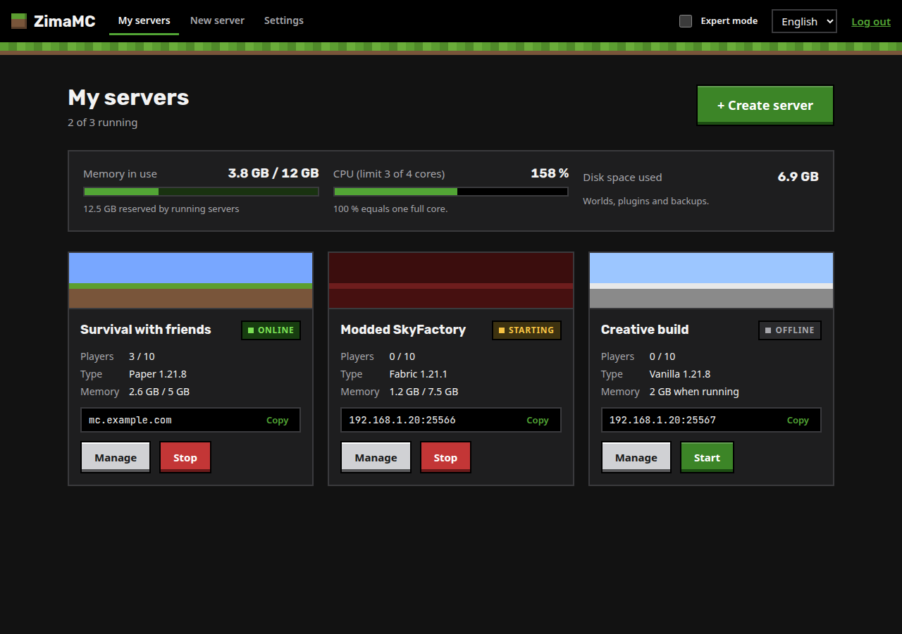

# ZimaMC

**Your own Minecraft server in a few clicks, for ZimaOS.**

ZimaMC is a web app for [ZimaOS](https://www.zimaspace.com/) (and CasaOS) that lets anyone create and run Minecraft Java servers without touching a terminal. The simple path is three steps: name, game, size. Everything else is behind **Expert mode**.



## Features

- **One-click servers**: Paper (plugins), Vanilla, Fabric and Forge (mods). Several servers at once.
- **Performance limits**: every server gets its own memory and CPU limit, and you set a global limit for all servers together, so Minecraft never takes over the whole machine.
  - Memory is *reserved*: a server only starts if its memory still fits in the global limit.
  - CPU is *shared*: running servers are scaled down live so that together they stay within the global CPU limit.
- **Plugins and mods from [Modrinth](https://modrinth.com)**: search, install with dependencies, update and remove. Only versions compatible with your server are shown.
- **Let friends join**, in three levels:
  1. Your public address, with automatic router port opening (UPnP / NAT-PMP) and a connection test.
  2. **Your own domain via Cloudflare**: a prefilled token link, then ZimaMC creates the A and SRV records and keeps them updated when your home IP changes (dynamic DNS).
  3. **A playit.gg tunnel** for connections behind CGNAT, where ports can't be opened. You approve the machine once and ZimaMC creates the tunnel.
- **Console** with live log and commands.
- **Players**: whitelist, operators, bans and kicks.
- **Backups**: manual or scheduled, with retention, restore and download.
- **File manager**: browse, edit, upload and download.
- **Multilingual** (English and Czech so far). Adding a language means adding one JSON file, see [CONTRIBUTING.md](CONTRIBUTING.md).

## Install on ZimaOS

1. Open the **App Store** in ZimaOS and click **+** → **Install a customized app**.
2. Choose **Import**, paste the contents of [`docker-compose.yml`](docker-compose.yml) and install.
3. Open ZimaMC from the dashboard (port **8765**), choose a password and a performance limit, and create your first server.

The app needs access to `/var/run/docker.sock` so it can start the Minecraft servers as separate containers ([`itzg/minecraft-server`](https://github.com/itzg/docker-minecraft-server)). All data lives in `/DATA/AppData/zimamc`.

**Forgot the password?** In the app's settings in ZimaOS, add the environment variable `RESET_PASSWORD=true` and restart the app. Then remove the variable again.

## How it works

```
ZimaOS (Docker)
 ├─ zimamc              web UI + API (host network, port 8765)
 │    └─ /var/run/docker.sock, /DATA/AppData/zimamc
 ├─ zimamc-srv-<id>     one container per Minecraft server, with --memory / --cpus limits
 └─ zimamc-playit       optional playit.gg agent
```

- `backend/`: Node.js + TypeScript (Fastify, dockerode). The state is stored in `zimamc.json` in the data folder.
- `frontend/`: React + Vite. Translations are in `frontend/src/locales/*.json`.

## Development

```bash
npm install
npm run dev          # backend on :8765, frontend on :5173 (proxies /api)
npm test             # backend tests
npm run typecheck
npm run build        # production build
```

Docker must be running locally. By default data goes to `./data`; set `DATA_DIR` to change it.

| Variable | Default | Meaning |
| --- | --- | --- |
| `PORT` | `8765` | Web UI port |
| `DATA_DIR` | `./data` | Where servers, backups and settings are stored |
| `HOST_DATA_DIR` | `DATA_DIR` | The same folder as the Docker host sees it (only needed if the paths differ) |
| `MC_IMAGE` | `itzg/minecraft-server` | Image used for servers |
| `RESET_PASSWORD` | – | `true` removes the password on start |

## License

MIT. Minecraft is a trademark of Mojang Synergies AB. ZimaMC is not affiliated with Mojang or Microsoft.
